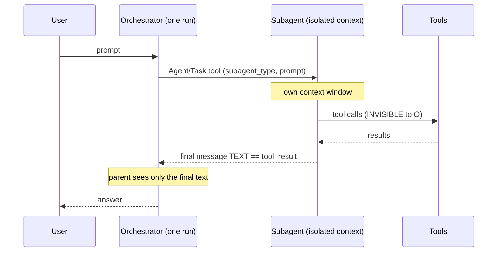
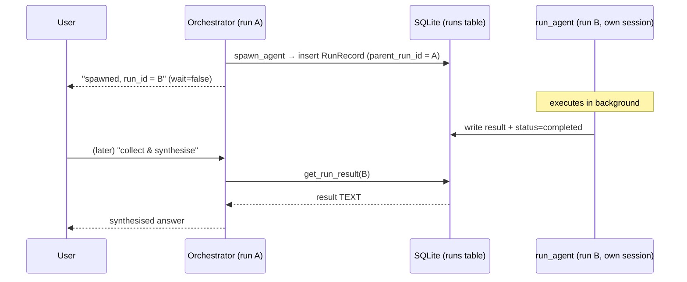
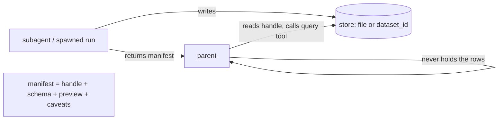

# Delegation in bran: subagents vs spawned runs

bran has **two distinct ways** for one agent to hand work to another. They look
similar in the UI but integrate completely differently. Knowing which is which —
and how a child's data reaches its parent — is the difference between a clean
design and a confusing one.

> TL;DR: data only ever crosses an agent boundary as **text** (the child's final
> message, or its stored `result`). There is no shared structured state, no typed
> objects, no automatic propagation of a child's intermediate data.

---

## 1. SDK subagent — the `Task` / `Agent` tool

The SDK's built-in delegation. One agent calls the `Agent` tool (named `Task`
before SDK v2.1.63 — both names appear) with a `subagent_type` and a prompt.

- "**task**" = the tool call; "**subagent**" = the agent it invokes. They're two
  halves of one mechanism, not two mechanisms.
- The subagent runs in its **own isolated context window**. Its intermediate tool
  calls happen out of the parent's sight.
- **Synchronous**: the parent blocks until the subagent returns, within the same
  turn. One run — no separate persisted run row.
- bran records only the delegation *name* in `record.metadata.subagents_invoked`
  (`runner.py:_absorb_message`) for the UI. That's observability, not data flow.

### How the parent gets the child's data

The subagent's **final message text** is returned as the **tool result**, inline
in the parent's transcript. The parent sees **only that final text** — never the
child's intermediate steps. (That isolation is the point: the child's tool noise
never enters the parent's context.)

---

## 2. bran `spawn_agent` — a fleet run

bran's own mechanism (`mcp__bran__spawn_agent`) for fan-out and long background
work. It creates a **separate, persisted `RunRecord`** and runs a full
independent SDK session via `run_agent`.

- `wait=true`  → blocks, returns the child's result inline (like a subagent, but
  it's a real persisted run with its own transcript).
- `wait=false` → returns a `run_id` immediately; the run executes in the
  background. **Asynchronous.**
- Linkage is parent → child: the child stamps `parent_run_id = current_run_id`
  and inherits `current_project_id` (ambient contextvars set in
  `runner._drive`, see `background.py`).

### How the parent gets the child's data

Later, by **id**: `get_run_result(run_id)` (`tools/runs.py`) reads the child's
stored `result` text from SQLite. The parent fans out N spawns, collects each by
id, and synthesises. The full result is available, plus the child's own
transcript in the UI.

---

## How each level accesses its child's data

| | Subagent (`Task`/`Agent`) | Spawned run (`spawn_agent`) |
|---|---|---|
| Data path | **return value** (tool result) | **shared SQLite**, read by `run_id` |
| Visibility to parent | final text only | full stored result + own transcript |
| Timing | synchronous (parent waits) | sync (`wait=true`) or async + collect later |
| Identity | no separate run row | own `RunRecord`, own session |
| Context cost | child's noise stays isolated | fully decoupled process |
| Linked by | (nothing persisted) | `parent_run_id` ← `current_run_id` contextvar |

**Direction matters.** Parent → child is recorded in the DB (`parent_run_id`).
Child → child's *data* flows back **only** as text: a return value (subagent) or
an id-keyed DB read (spawn). No shared memory, no object references.

---

## What a tool result can contain

A tool result is a list of **content blocks**. The model ingests exactly two
kinds:

- **text** — prose, or a "table"/structured data serialized as Markdown / CSV /
  JSON. There is no first-class table or object type; it's all tokens.
- **image** — base64 (a chart, screenshot). The model reads these via vision.

Caveats:

- The **`Task`/`Agent` subagent return is plain text only** — a subagent cannot
  hand an image up. To pass an image or large dataset, have it **write a file**
  and pass the **path** (see artifacts / working folder).
- For big or fidelity-sensitive data, prefer a **file artifact** (CSV/JSON in the
  project working folder) + pass the path, rather than stuffing a huge table into
  the text. Cheaper in tokens, lossless.

### A child's table, concretely

A subagent that computed a table must **re-emit it in its final answer** (e.g. a
Markdown table) for the parent to have it. Its intermediate tool result that
*contained* the rows is in the **subagent's** context only — invisible to the
parent. "I found the data" loses the data.

---

## Moving tabular data — the handle + manifest pattern

Because data only crosses an agent boundary as text, moving a *table* (or any
sizeable dataset) needs a deliberate architecture. The principle:

> **Keep data on a deterministic path; keep the LLM on the decision path.** An
> LLM should never *transcribe* a table — that's where rows drop, numbers drift
> and tokens explode. The LLM passes **handles** (paths/ids) and reads
> **summaries**; the actual bytes move via tools and files.

### The pattern

1. **The child writes** the table to a store under a stable handle — a file
   (`CSV`/`Parquet`/`JSON`) or a dataset id.
2. **The child returns a manifest, not the rows** — handle + schema
   (columns/types) + row count + a tiny preview (first ~5 rows) + provenance +
   caveats. Small, cheap, lossless-by-reference.
3. **The parent orchestrates over manifests** — decides what to join / compare /
   rank — and delegates the actual data ops to a **deterministic tool**
   (`query`/`merge` taking handles → a new handle, run by pandas/DuckDB, *not* the
   model).
4. **A render tool** emits the final table/file for the user from a handle.

### Why this wins

- **Fidelity** — the table is never re-typed by an LLM.
- **Tokens** — only manifests live in context, not 10k-row tables.
- **Composability** — handles chain (one step's output is the next step's input).
- **Verifiability** — you can open any handle and check it.
- **It unifies subagents and spawns** — both just write a handle and return a
  manifest; the parent reads the handle the same way (inline text for a subagent,
  `get_run_result` for a spawn). So the sync/async choice no longer has to be
  perfect *for the data to survive*. That's the mix-up insurance.

### Mapping to bran

The substrate already exists: the project **working folder (`work_dir`)** + the
**artifacts** table. Subagents can already write files there (the confinement
hook admits `work_dir`; writes are recorded as artifacts).

The minimal addition that makes this first-class is a least-privilege **`dataset`
tool group** (same shape as `read_pdf` / `bran_docs`):

- `write_dataset(rows|path) → dataset_id`  (persists to `work_dir`, e.g. Parquet/DuckDB)
- `dataset_head(id, n)` → preview + schema  (the cheap manifest)
- `query_dataset(id, sql)` → new `dataset_id`  (DuckDB does the join/agg deterministically)
- `render_dataset(id) → markdown | csv path`  (final presentation)

Agents then trade `dataset_id`s instead of pasting tables, and the orchestrator
does set logic by handle.

### Anti-patterns (the inverse of a clean design)

- ❌ Child returns the full table **in its final text** → token blow-up +
  transcription drift.
- ❌ Parent asks the **LLM to merge/aggregate** two tables in-context → silent
  math/row errors. Use a query tool.
- ❌ Data left only in the child's **intermediate** tool result → invisible to the
  parent.

---

## Choosing — and signs you've mixed them

Use a **subagent** when:
- you need the answer **now**, within this turn, and
- you want **context economy** (keep the child's tool noise out of the parent).
- e.g. "research X and give me the synthesised result."

Use **`spawn_agent`** when:
- the work is **long** or the user **shouldn't wait**, or
- you're **fanning out** several tasks to collect later, or
- you want each run **persisted** with its own transcript.

Anti-patterns (the "have I mixed them?" checklist):

- ❌ Expecting **structured data** to propagate between levels automatically — only
  text crosses. Serialize it.
- ❌ Using a **subagent for long fan-out** the user shouldn't block on → use
  `spawn_agent(wait=false)` + `get_run_result`.
- ❌ Using `spawn_agent(wait=true)` in a loop when you really wanted **in-turn
  context isolation** → a subagent is simpler and cheaper.
- ❌ Trying to read a subagent's **intermediate** tool output from the parent —
  impossible; have the subagent emit a summary of it.
- ❌ Passing a **giant table as text** when fidelity matters → write a file, pass
  the path.
- ⚠️ Remember a subagent can itself call tools (and even spawn) — but its parent
  still only ever sees its **final text**, however deep the tree goes.
